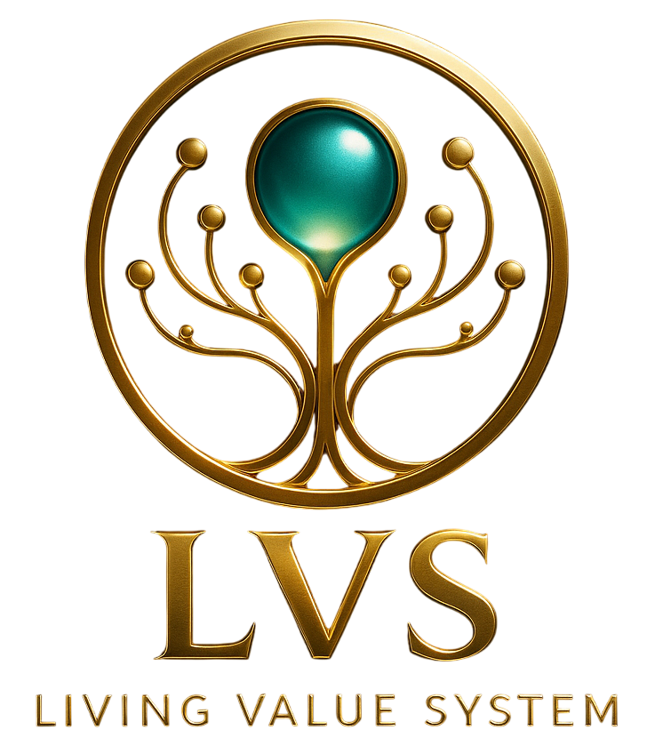

  

LVS Core

LVS Core is the TypeScript reference implementation of the Living Value System (LVS) — a post-blockchain value network where value is secured by trust, protection, and regeneration, instead of blocks, mining, or gas fees.

This repository contains:
✔ the core simulation engine (VU + TC + Vault + Regenerator)
✔ a CLI demo
✔ the full technical documentation set (PDF)
✔ protocol specifications, architecture, research materials
✔ LIP proposals (Living Improvement Proposals)

Status: research prototype.
Not production-ready. Internal APIs and interfaces may change.

1. Repository Structure
lvs-core/
 ├── src/                      # TypeScript core (engine + CLI demo)
 │    ├── index.ts
 │    ├── state.ts
 │    ├── types.ts
 │    └── sim.ts
 │
 ├── docs/                     # Full LVS documentation (PDF)
 │    ├── whitepaper/
 │    ├── research/
 │    ├── consensus/
 │    ├── architecture/
 │    ├── api/
 │    ├── spec/
 │    └── mvp/
 │
 ├── lips/                     # LIP – Living Improvement Proposals
 │    └── LIP-0004-regenerator-and-rejections.md
 │
 ├── assets/logo/              # Branding / logos
 │    ├── lvs-logo.png
 │    ├── lvs-logo-banner.png
 │    └── lvs-logo-full.png
 │
 ├── CONTRIBUTING.md           # Contribution rules
 ├── GOVERNANCE.md             # Governance model
 ├── SECURITY.md               # Security policy
 ├── LICENSE                   # Composite LVS License
 ├── CODE_OF_CONDUCT.md        # To be added
 ├── package.json
 └── tsconfig.json

2. Documentation Set
Whitepaper

LVS Whitepaper

LVS One-Pager

Research

Research Paper Draft

LVS Master Document

Consensus

Drift Consensus Specification

LVS Protocol Specification

Architecture

Technical Architecture

MVP Prototype Architecture

API

Developer API Guide

Spec / Deep Dive

Node Implementation Blueprint

Security Deep Dive

MVP / Testnet

Testnet Launch Plan

Website Content Package

All documents are located inside docs/.

3. Building & Running
Install dependencies:
npm install

Run the simulation demo:
npm run start

This launches the CLI simulation of trust dynamics, VU flows, rejections, and regeneration behavior.

4. Security

See SECURITY.md.

Summary:

LVS is a critical-infrastructure project.

Vulnerabilities should be reported privately.

Public disclosure is prohibited.

A PGP key will be added.

Do NOT:

publish vulnerabilities publicly

open GitHub issues about security

discuss vulnerabilities on social media or chats

We respond within 72 hours with status updates within 7 days.

5. Governance

Governance defines:

improvement process

voting rules

LIP lifecycle

responsibilities of maintainers

See GOVERNANCE.md.

6. Contributing

Pull requests are welcome only for:

documentation improvements

simulation/TS logic corrections

new LIP proposals

See CONTRIBUTING.md.

7. License

This repository uses a composite licensing model, identical to lvs.network.

1. Documentation / Website / Non-core Materials

Licensed under Apache License 2.0 — free use, modification, distribution with attribution.

2. LVS Core Protocol / Reference Node / Consensus Logic

Not open-source at this stage.
Licensed under the LVS Core Technology License, which prohibits:

redistribution

modification

commercial use

deployment

publishing derivative works

until the official open-source release by the LVS Foundation.

3. Trademarks

“LVS”, “LVS Network”, “Living Value System” and logos are trademarks of the LVS Foundation.
Trademark usage is not granted by this license.

See full text in LICENSE.

8. Code of Conduct

A CODE_OF_CONDUCT.md file will define:

expected community behavior

anti-abuse rules

communication guidelines

PR/issue etiquette

I will generate this file as soon as you say “make CODE_OF_CONDUCT.md”.

9. Project Status

✔ repository structure complete
✔ full documentation included
✔ governance, contributing, and security policies added
✔ logos integrated
✔ license compliant
✔ README at protocol-grade level
